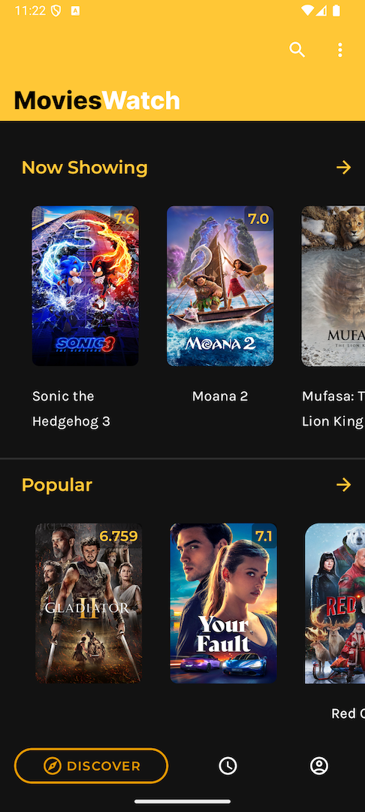
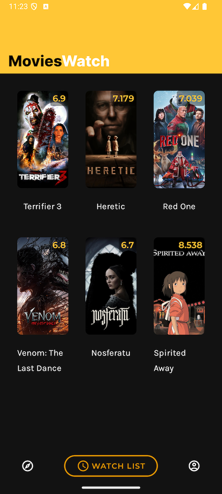

# MoviesWatchPro

MoviesWatchPro is an Android application that fetches and displays movies from an API, categorized into New, Upcoming, Trending, Now Showing, and Popular. The app is built using modern Android development practices, featuring Kotlin, Jetpack Compose, and the MVI architecture.

## Features

- **Movies Categorized**:
  - New Movies
  - Upcoming Movies
  - Trending Movies
  - Now Showing
  - Popular Movies
- **Modern UI**: Designed using Jetpack Compose for a sleek and responsive user experience.
- **Architecture**: Implements the MVI (Model-View-Intent) architecture for a unidirectional data flow.
- **Kotlin First**: Entirely written in Kotlin, leveraging its features for clean and concise code.

## Screenshots





- **Home Screen**: Displays categorized movies.
- **Movie Details**: View detailed information about each movie.

## Tech Stack

- **Kotlin**: A modern, concise, and safe programming language for Android development.
- **Jetpack Compose**: Declarative UI framework for building native Android apps.
- **MVI Architecture**: Ensures a predictable and maintainable unidirectional data flow.
- **Coroutines & Flow**: For asynchronous programming and managing data streams.

## Installation

1. **Clone the repository**:
   ```bash
   git clone https://github.com/donMuthiani/MoviesWatchPro.git
